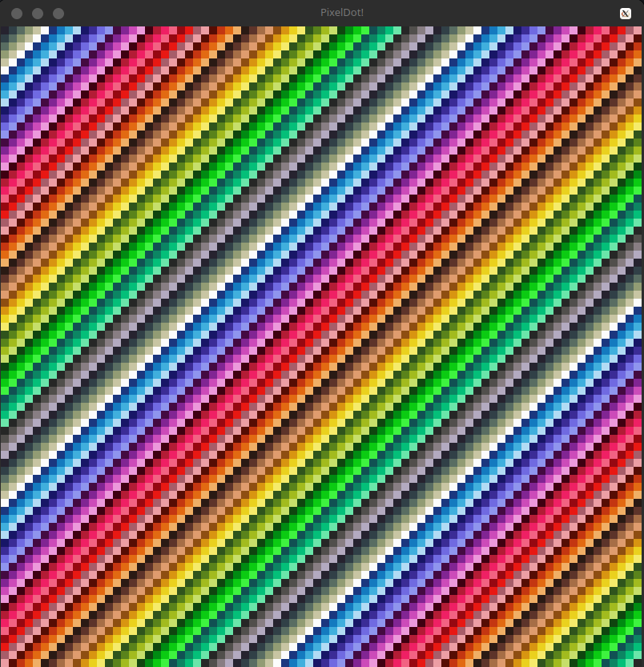

# PixelDot
PixelDot is a simple game framework written in C# utilising SFML.net to provide a fantasy console-esque environment for creating games with imposed limitations and is based around only using individual pixels as the base unit of graphics. This project is not intended to be used a game framework but playground to experiment with.

## Creating applications
You create "Applications" which contain an create, update and end method where you can use a variety of methods provided by PixelDot.

To create an application, you must inherit from the `Application` class and use the `CurrentApplication` attribute.

Note that if you have more than `CurrentApplication` with the run argument set to true, you will get an exception as this isn't supported. See `src/Applications` for example applications.

## Running applications
After you create the application and set run argument to true in the `CurrentApplication` attribute, you must provide three arguments to the application `window X`, `window Y` and `pixel scale`.

A simple script to compile and run the application can be found in `test-run.sh` (Linux/Mac OS X users) and `test-run.bat` (Windows users)

## Provided classes
- `Palette` (struct) - This provides the predefined colour palette supported by PixelDot
- `Logger` - This provides functionality to log information to the console for debugging.
- `Input` - This class provides input support, keyboard and mouse for PixelDot.
- `Core` - This is a very important class, it contains the core of the framework, provides abstractions over SFML.net for drawing pixels to the screen, etc.